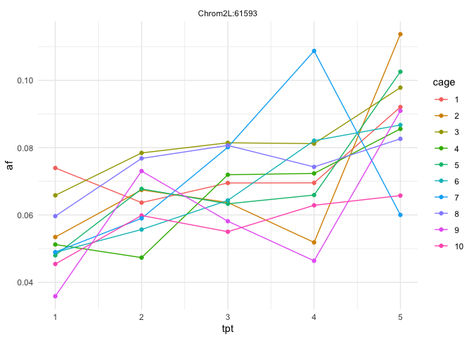
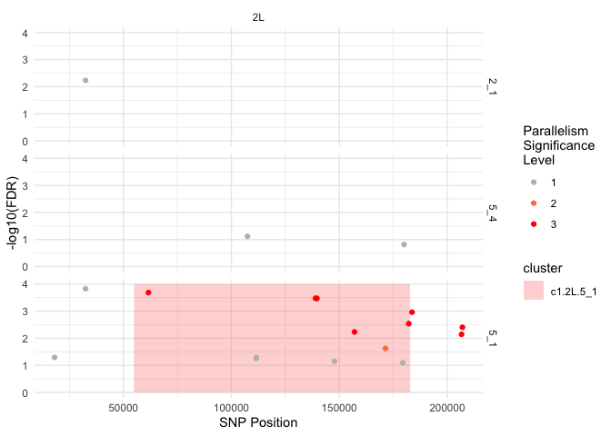

# dros-adaptive-tracking tutorial

## Running the analysis workflow

The full workflow is designed to be run after calculating GLM p-values
for each desired time segment or population comparison, using the
function:

`results  <- RunFullWorkflow( HAFsFile, glmFile, snpFile, comparisons, cages, fdrThreshs, esThreshs, windowSize, windowShift, maxClusterGap, maxSNPpairDist, linkageThresh, maxthreads)`

All of these parameters can be defined in a config file, such as the
example `config.R` included in the `test_data` directory.

## Input file formats

Examples of the three main input files (`HAFsFile, glmFile, snpFile`)
can be found in the `test_data` folder of the main repo. These test
files are for a subset of 1,000 SNPs on a single chromosome, assayed
across 50 pool-seq samples.

**HAFsFile** is a .Rdata file consisting of 3 separate variables:
`afmat`, `sites`, and `samps`. (HAFs is an acronym for
**H**aplotype-derived **A**llele **F**requencies).

- `afmat` should be a numeric matrix where the rows are SNPs and the
  columns are samples. Each value in the matrix gives the frequency of
  the alternate allele at that SNP site in that sample.

- `sites` should be a two column data frame indicating the chromosome
  and numeric position of each SNP (row) in afmat. The columns should be
  named `chrom` and `pos` . (Additional columns are fine but they will
  be ignored)

- `samps` should be a three column data frame indicating the timepoint
  and cage/replicate_num of each sample (column) in afmat. The columns
  should be named `tpt` and `cage` . (Additional columns, such as
  `sampID` are fine but they will be ignored).

``` r
load(paste0(repo_dir,"test_data/HAFs_1ksites.Rdata"))
dim(afmat)
```

    [1] 1000   50

``` r
afmat[1:5,1:5]
```

         E10_Female_1 E10_Female_2 E10_Female_3 E10_Female_4 E10_Female_5
    [1,]   0.28993800    0.3332700    0.3408150   0.24332700   0.33936200
    [2,]   0.00878198    0.0152688    0.0106241   0.00703872   0.00362206
    [3,]   0.09535020    0.1557900    0.1356860   0.15659400   0.08012840
    [4,]   0.06716430    0.1015850    0.0913108   0.10350600   0.06492350
    [5,]   0.27837400    0.3220750    0.3328220   0.23375100   0.33140900

``` r
head(samps)
```

             sampID tpt cage
    1: E10_Female_1   1   10
    2: E10_Female_2   2   10
    3: E10_Female_3   3   10
    4: E10_Female_4   4   10
    5: E10_Female_5   5   10
    6:  E1_Female_1   1    1

``` r
head(sites)
```

      chrom  pos
    1    2L 5390
    2    2L 5399
    3    2L 5465
    4    2L 5598
    5    2L 5762
    6    2L 5803

Note that the row-order of sites is assumed to be the same as the
row-order of afmat, and the row-order of samps is assumed to be the same
as the column-order of afmat!

**glmFile** is a .Rdata or .RDS file consisting of one data.frame:
`df.glm`, containing p-values and coefficients from a GLM-based test of
parallelism for each SNP site.

- The first two columns should be `chrom` and `pos` , and subsequent
  columns should be labeled either `coef.<comparison>` or
  `p.<comparison>` where `<comparison>` is a label for the end and start
  timepoints of the parallelism test separated by `"_"` - for example,
  in the test data, `coef.2_1` and `p.2_1` refer to coefficients and
  p-values from a test of parallelism across timepoints 1-\>2.

- The dataframe can contain as many `coef.` and `p.` column pairs as
  you’d like.

- The `comparisons` parameter of `RunFullWorkflow` should be a character
  vector of which comparison labels you’d like to analyse (eg.
  `comparisons=c("2_1","3_2","4_3","5_4")` ), or `NULL` (default) to
  analyse all comparison labels found in the dataframe.

- NOTE: p-values in df.glm should *not* have already been FDR-adjusted!
  (this happens within the workflow)

``` r
load(paste0(repo_dir,"test_data/glm_1ksites.Rdata"))
dim(df.glm)
```

    [1] 1000   22

``` r
head(df.glm)
```

      chrom  pos    coef.2_1    coef.3_1    coef.4_1    coef.5_1     coef.3_2
    1    2L 5390 -0.06139584  0.04383380  0.10236115 -0.05334404  0.105229643
    2    2L 5399 -0.41206839 -0.12357358 -1.10897999 -1.10898867  0.288494808
    3    2L 5465 -0.04245118 -0.04891410  0.18803285 -0.09446808 -0.006462920
    4    2L 5598  0.01753001  0.08872576  0.24447956  0.14428439  0.071195753
    5    2L 5762 -0.05866119  0.04343516  0.09750387 -0.06615815  0.102096352
    6    2L 5803 -0.18352227 -0.18536506 -0.09299147 -0.08838607 -0.001842786
        coef.4_2     coef.5_2    coef.4_3    coef.5_3      coef.5_4     p.2_1
    1  0.1637570  0.008051800  0.05852734 -0.09717784 -1.557052e-01 0.9671757
    2 -0.6969116 -0.696920284 -0.98540641 -0.98541509 -8.682342e-06 0.8088134
    3  0.2304840 -0.052016895  0.23694696 -0.04555398 -2.825009e-01 0.9974532
    4  0.2269495  0.126754379  0.15575379  0.05555863 -1.001952e-01 0.9998733
    5  0.1561651 -0.007496956  0.05406871 -0.10959331 -1.636620e-01 0.9716596
    6  0.0905308  0.095136198  0.09237359  0.09697898  4.605399e-03 0.4403581
          p.3_1     p.4_1     p.5_1     p.3_2     p.4_2     p.5_2     p.4_3
    1 0.9902420 0.8086906 0.9802525 0.8000845 0.4099294 0.9999885 0.9705510
    2 0.9965593 0.1349283 0.1349710 0.9447620 0.6374787 0.6374599 0.2460003
    3 0.9956300 0.5521788 0.9504639 0.9999986 0.3480392 0.9947545 0.3223417
    4 0.9329762 0.1632328 0.6904291 0.9688116 0.2228837 0.7808218 0.5883344
    5 0.9904469 0.8338133 0.9564045 0.8135057 0.4543781 0.9999912 0.9776728
    6 0.4297405 0.9051430 0.9200119 1.0000000 0.9254720 0.9118679 0.9201941
          p.5_3     p.5_4
    1 0.8418324 0.4609407
    2 0.2460172 1.0000000
    3 0.9968934 0.1664546
    4 0.9862868 0.8772172
    5 0.7710513 0.4057476
    6 0.9060445 0.9999993

**snpFile** is a .csv or .tsv file containing the genotype call
(-1/0/0.5/1 corresponding to missing/ref/het/alt calls) for each SNP
site (rows) in each founder line (columns).

- There should be a separate snpFile for each chromosome, differing in
  name only by the name of the chromosome. The snpFile parameter passed
  to RunFullWorkflow should be a single text string indicating the
  location of the snpFiles, with `CHROM` as a placeholder for chromosome
  name. For example, if my snpFiles were all in the directory
  `/data/snps/` and had the filenames
  `founder_genotypes.Chr1.csv`,`founder_genotypes.Chr2.csv` , and
  `founder_genotypes.Chr3.csv` , I would pass
  \`“`` /data/snps/founder_genotypes.CHROM.csv"` `` as the snpFile
  argument to RunFullWorkflow.

- The first column of each snpTable file should be the numeric position
  of the SNP on that chromosome, and all subsequent columns should
  correspond to founder genotypes. The file does not need to have column
  headers (they will be ignored).

``` r
snpFile=paste0(repo_dir,"test_data/founder_genotypes_1ksites.CHROM.snpTable.numeric.csv")
mychrom="2L"
snps=fread(gsub("CHROM",mychrom,snpFile));
dim(snps)
```

    [1] 1787   82

``` r
head(snps[1:5,1:5])
```

         V1 V2 V3 V4 V5
    1: 5390  0  1  0  0
    2: 5399  0  0  0  0
    3: 5429  0  0  0  0
    4: 5465  0  1  0  0
    5: 5495  0  0  0  0

## Data subsets

The parameters **comparisons** and **cages** can be set to character
vectors of the subset of timepoint comparisons (eg.
`comparisons=c("2_1","5_1")` to be analyzed, or the subset of cages to
use for defining allele frequency shifts (eg. `cages=1:4`). If these
parameters are left as `NULL` (default), all comparisons found in
`df.glm` and cages found in `samps` will be used.

## GLM significance thresholds

The parameters **fdrThreshs** and **esThreshs** can be used to define
levels of parallelism significance. `fdrThreshs` refers to FDR-corrected
GLM pvalues and `esThreshs` refers to thresholds on effect size, as
defined by the average allele frequency shift from the start to the end
of the time-segment tested. For example, the thresholds defined in
test_data/config.R are:

``` r
fdrThreshs=c(.2,.05,.01) ## maximum fdr-corrected pvalue for difference in allele frequency between treatments for a site to be considered significantly diverged
esThreshs=c(0,0.02,0.02) ## minimum mean allele frequency difference between treatments for a site to be considered significantly diverged (combined with p-value)
```

and indicate that level1 significance requires an FDR-corrected pvalue
\< 0.2 and no limits on effect size, while level2 significance requires
an FDR-corrected pvalue \< 0.05 and an absolute average allele frequency
shift of 2%. These significance levels will be used in defining genomic
windows enriched for significant SNPs during the clustering procedure.

## Clustering parameters

**windowSize**, **windowShift**, **maxClusterGap**, **maxSNPpairDist**,
**linkageThresh** are all parameters related to defining local clusters
of linked significant SNPs. It is recommended to leave them at the
default values.

## Parallel processing

Certain functions (`score_wins`, `get_matched_pairs`, and
`calc_Rsq_for_snp_pairs`) make use of parallel processing via mclapply
and mcmapply. Set **ncores** to the number of threads available to use.
It is highly recommended to run these functions with as many threads as
possible since they can take a very long time otherwise.

## Test run!

Note that this is only an example. With such a small subset of SNPs
tested, the results may be somewhat unreliable.

``` r
## SETUP - edit this to your desired paths
localDir="/Users/me/Documents/scripts/dros-adaptive-tracking" ### ie. "~/data/orchard_2014";
scriptsDir="/Users/me/Documents/scripts/dros-adaptive-tracking" ### ie. "~/GitHub/dros-adaptive-tracking"
configFile="test_data/config.R" ### ie. test_data/config.R

## FUNCTIONS
setwd(scriptsDir)
source("analysis_workflow/workflow_functions.R")
source("analysis_workflow/plotting_functions.R")
source("analysis_workflow/helper_functions.R")
source("analysis_workflow/load_packages.R")
setwd(localDir)

## PARAMETERS
source(configFile)
ncores=parallel::detectCores()-1

## RUN WORKFLPW
results=RunFullWorkflow(HAFsFile,glmFile,snpFile,comparisons,cages,fdrThreshs,esThreshs,windowSize,windowShift,maxClusterGap,maxSNPpairDist,linkageThresh,ncores)
```

    loading GLM results..
    running analysis for comparisons:
     + 2_1
    + 3_2
    + 4_3
    + 5_4
    + 5_1 
    loading HAFs data..
    running analysis for cages:
     + 1
    + 2
    + 3
    + 4
    + 5
    + 6
    + 7
    + 8
    + 9
    + 10 
    finding parallel sites..
    classifying parallel sites..
    scoring windows..
    500 -SNP windows with  100 -SNP shift
    500 -SNP windows with  100 -SNP shift
    1 ..
    0 ..
    0 ..
    2 ..
    18 ..
    finding initial clusters..
    1 initial clusters found..
    extracting trajectories for top cluster sites..
    finished.
    20 parallel sites in 1 clusters

``` r
## PLOT

### plot allele frequency trajectory of cluster marker SNP
##########
results$clMarkerAF %>% mutate(cage=factor(cage)) %>%
  mutate(snp_label=paste0("Chrom",chrom,":",pos)) %>%
  ggplot(aes(x=tpt,y=af,color=cage,group=cage)) + geom_line() + geom_point() + theme_minimal() + facet_wrap(~snp_label)
```



``` r
### make manhattan plot with clusters shaded
##########
results$clusters %>% 
  dplyr::select(chrom,cl,startPos,endPos,comparison) %>% 
  pivot_longer(cols = c(startPos,endPos),
               names_to = "posType",values_to = "pos") %>%
  ggplot(aes(x=pos)) + 
  geom_area(aes(y=4,fill=cl),alpha=.3) + 
  geom_point(data=results$sigSites, aes(y=-1*log10(FDR),color=factor(sigLevel)))  + 
  theme_minimal() + facet_grid(comparison ~ chrom) + 
  scale_color_manual(values=c("gray","coral","red")) + 
  labs(x="SNP Position",y="-log10(FDR)",fill="cluster",
       color="Parallelism\nSignificance\nLevel")
```


