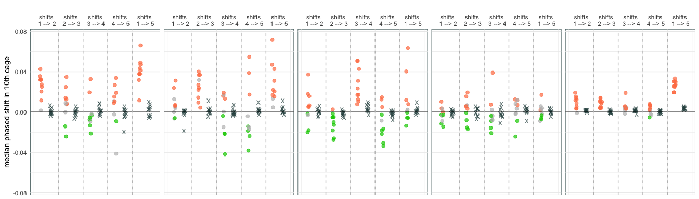

Figures for dros-adaptive-tracking
================
Sharon Greenblum
2021-01-24

Main Figures
------------

<!-- -->

Tables
------

|                     |   2L |   2R |   3L |   3R |   X |
|---------------------|-----:|-----:|-----:|-----:|----:|
| Timepoint 1 –&gt; 2 |   42 |    4 |    6 |   67 |   4 |
| Timepoint 2 –&gt; 3 |    4 |    0 |  109 |    5 |   0 |
| Timepoint 3 –&gt; 4 |  178 |  109 | 1453 |  858 | 137 |
| Timepoint 4 –&gt; 5 |  306 |  156 |   93 |  642 | 101 |
| Timepoint 1 –&gt; 5 | 1294 | 1085 |  997 | 1146 | 514 |

Counts of significantly parallel sites

<table class="striped">
<caption>
Counts of clusters
</caption>
<thead>
<tr>
<th style="text-align:left;">
</th>
<th style="text-align:right;">
2L
</th>
<th style="text-align:right;">
2R
</th>
<th style="text-align:right;">
3L
</th>
<th style="text-align:right;">
3R
</th>
<th style="text-align:right;">
X
</th>
<th style="text-align:right;">
All
</th>
</tr>
</thead>
<tbody>
<tr>
<td style="text-align:left;">
Timepoint 1 –&gt; 2
</td>
<td style="text-align:right;">
1
</td>
<td style="text-align:right;">
1
</td>
<td style="text-align:right;">
1
</td>
<td style="text-align:right;">
2
</td>
<td style="text-align:right;">
0
</td>
<td style="text-align:right;">
5
</td>
</tr>
<tr>
<td style="text-align:left;">
Timepoint 2 –&gt; 3
</td>
<td style="text-align:right;">
2
</td>
<td style="text-align:right;">
0
</td>
<td style="text-align:right;">
6
</td>
<td style="text-align:right;">
2
</td>
<td style="text-align:right;">
0
</td>
<td style="text-align:right;">
10
</td>
</tr>
<tr>
<td style="text-align:left;">
Timepoint 3 –&gt; 4
</td>
<td style="text-align:right;">
1
</td>
<td style="text-align:right;">
4
</td>
<td style="text-align:right;">
10
</td>
<td style="text-align:right;">
20
</td>
<td style="text-align:right;">
1
</td>
<td style="text-align:right;">
36
</td>
</tr>
<tr>
<td style="text-align:left;">
Timepoint 4 –&gt; 5
</td>
<td style="text-align:right;">
5
</td>
<td style="text-align:right;">
6
</td>
<td style="text-align:right;">
8
</td>
<td style="text-align:right;">
11
</td>
<td style="text-align:right;">
9
</td>
<td style="text-align:right;">
39
</td>
</tr>
<tr>
<td style="text-align:left;">
Timepoint 1 –&gt; 5
</td>
<td style="text-align:right;">
12
</td>
<td style="text-align:right;">
16
</td>
<td style="text-align:right;">
14
</td>
<td style="text-align:right;">
22
</td>
<td style="text-align:right;">
11
</td>
<td style="text-align:right;">
75
</td>
</tr>
<tr>
<td style="text-align:left;">
All
</td>
<td style="text-align:right;">
21
</td>
<td style="text-align:right;">
27
</td>
<td style="text-align:right;">
39
</td>
<td style="text-align:right;">
57
</td>
<td style="text-align:right;">
21
</td>
<td style="text-align:right;">
165
</td>
</tr>
</tbody>
</table>

Note that the `echo = FALSE` parameter was added to the code chunk to
prevent printing of the R code that generated the plot.
